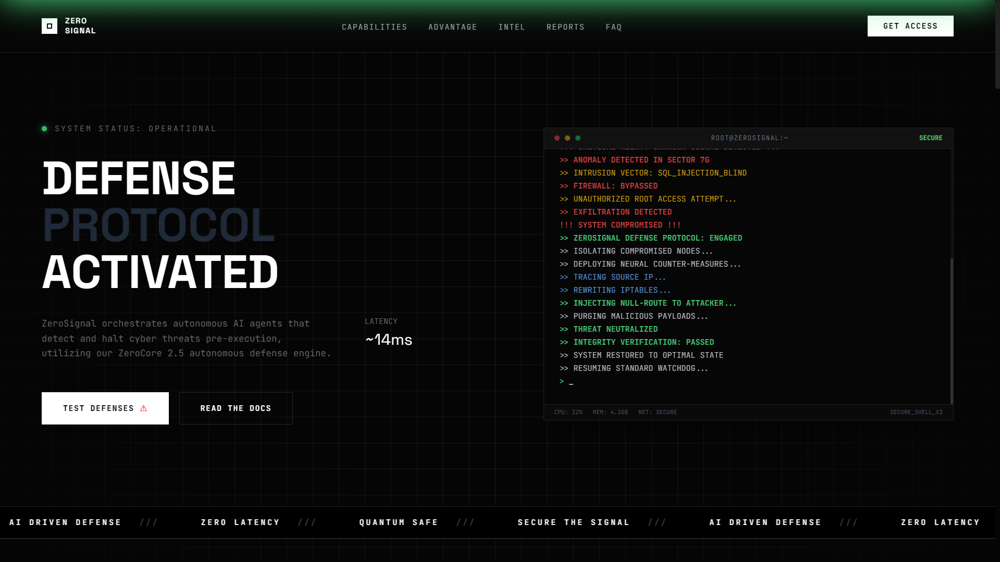

<div align="center">

# ⚡ ZERO SIGNAL



### Next-Generation Autonomous AI Threat Detection System

[](https://opensource.org/licenses/MIT)
[](https://reactjs.org/)
[](https://www.typescriptlang.org/)
[](https://vitejs.dev/)
[](https://tailwindcss.com/)

[Live Demo](#) • [Documentation](#) • [Report Bug](https://github.com/panduthegang/Zero-Signal-Saas/issues) • [Request Feature](https://github.com/panduthegang/Zero-Signal-Saas/issues)

</div>

---

## 📋 Table of Contents

- [Overview](#-overview)
- [Features](#-features)
- [Tech Stack](#-tech-stack)
- [Getting Started](#-getting-started)
  - [Prerequisites](#prerequisites)
  - [Installation](#installation)
  - [Development](#development)
  - [Build](#build)
- [Project Structure](#-project-structure)
- [Key Components](#-key-components)
- [Design Philosophy](#-design-philosophy)
- [Responsive Design](#-responsive-design)
- [Contributing](#-contributing)
- [License](#-license)
- [Contact](#-contact)

---

## 🎯 Overview

**ZERO SIGNAL** is a cutting-edge SaaS landing page showcasing an autonomous AI-powered threat detection system. Built with modern web technologies, it features a cyberpunk-inspired design with interactive elements including:

- Real-time threat simulation
- Live attack feed dashboard
- Interactive terminal interface
- Animated data visualizations
- Fully responsive mobile-first design

This project demonstrates advanced React patterns, TypeScript integration, and sophisticated UI/UX design principles suitable for high-tech SaaS products.

---

## ✨ Features

### 🔐 Interactive Defense Simulation
- **Live Threat Detection**: Click "Test Defenses" to trigger a real-time breach simulation
- **Visual Feedback**: Dynamic glitch effects, screen shake, and color transitions
- **Multi-Stage Response**: Watch the system detect, analyze, and neutralize threats

### 📊 Real-Time Dashboard
- **Live Traffic Monitoring**: SVG-based interactive charts with hover tooltips
- **Threat Analytics**: Real-time breakdown of attack vectors (DDoS, Malware, Phishing)
- **System Metrics**: CPU, memory, and network status monitoring
- **Packet Log Stream**: Live-updating terminal feed with color-coded events

### 🎨 Modern Design System
- **Cyberpunk Aesthetic**: Dark theme with neon green accents
- **Smooth Animations**: Framer Motion-inspired transitions and micro-interactions
- **Glassmorphism**: Backdrop blur effects and layered UI elements
- **Custom Typography**: Space Grotesk & JetBrains Mono font pairing

### 📱 Fully Responsive
- **Mobile-First**: Optimized for all screen sizes from 320px to 4K
- **Hamburger Menu**: Smooth slide-in navigation with social links
- **Touch Optimized**: Enhanced tap targets and gesture support
- **Adaptive Layouts**: Content reflows intelligently across breakpoints

### ⚡ Performance Optimized
- **Lightning Fast**: Vite-powered development and build process
- **Code Splitting**: Lazy loading for optimal bundle sizes
-- **Optimized Assets**: Compressed fonts and efficient SVG usage
- **Smooth 60fps**: Hardware-accelerated animations

---

## 🛠 Tech Stack

| Technology | Purpose |
|------------|---------|
|  | UI Framework |
|  | Type Safety |
|  | Build Tool |
|  | Styling |
|  | Icons |
|  | CSS Processing |
|  | Code Linting |

---

## 🚀 Getting Started

### Prerequisites

Before you begin, ensure you have the following installed:

- **Node.js** (v18.0.0 or higher)
- **npm** (v9.0.0 or higher) or **yarn** (v1.22.0 or higher)
- **Git**

Check your versions:
```bash
node --version
npm --version
git --version
```

### Installation

1. **Clone the repository**
   ```bash
   git clone https://github.com/panduthegang/Zero-Signal-Saas.git
   cd Zero-Signal-Saas
   ```

2. **Install dependencies**
   ```bash
   npm install
   ```

   Or with yarn:
   ```bash
   yarn install
   ```

### Development

Start the development server with hot module replacement:

```bash
npm run dev
```

The application will be available at `http://localhost:5173`

### Build

Create an optimized production build:

```bash
npm run build
```

Preview the production build locally:

```bash
npm run preview
```

### Linting

Run ESLint to check code quality:

```bash
npm run lint
```

Type check without emitting files:

```bash
npm run typecheck
```

---

## 📁 Project Structure

```
Zero-Signal-Saas/
├── public/
│   ├── image.png           # Favicon
│   └── ...
├── src/
│   ├── components/         # React Components
│   │   ├── Navbar.tsx      # Navigation with mobile menu
│   │   ├── Hero.tsx        # Hero section with terminal
│   │   ├── Terminal.tsx    # Interactive terminal widget
│   │   ├── Features.tsx    # Feature cards grid
│   │   ├── WhyChooseUs.tsx # Advantage section
│   │   ├── IntelSection.tsx# Live dashboard
│   │   ├── Testimonials.tsx# User testimonials
│   │   ├── Pricing.tsx     # Pricing tiers
│   │   ├── FAQ.tsx         # Accordion FAQ
│   │   ├── Footer.tsx      # Site footer
│   │   └── Marquee.tsx     # Scrolling text banner
│   ├── App.tsx             # Main app component
│   ├── main.tsx            # Entry point
│   ├── index.css           # Global styles
│   └── vite-env.d.ts       # Vite type definitions
├── index.html              # HTML template
├── package.json            # Dependencies
├── tsconfig.json           # TypeScript config
├── tailwind.config.js      # Tailwind configuration
├── vite.config.ts          # Vite configuration
└── README.md               # You are here
```

---

## 🧩 Key Components

### Navbar
- **Fixed positioning** stays visible during scroll
- **Scroll detection** changes background opacity
- **Hamburger menu** for mobile with slide-in animation
- **Smooth scroll** navigation to page sections

### Hero Section
- **Interactive terminal** with live log streaming
- **Breach simulation** button triggers multi-stage animation
- **Responsive layout** stacks on mobile, side-by-side on desktop

### Terminal Widget
- **Real-time logs** with color-coded message types
- **Scanline effect** for authentic CRT monitor look
- **Tech borders** with dynamic corner accents
- **System metrics** footer with live status

### Intelligence Dashboard
- **SVG line chart** with smooth animations
- **Hover interactions** show detailed tooltips
- **Threat breakdown** with animated progress bars
- **Live packet log** with fading entries

### Pricing Section
- **3-tier structure** with highlighted recommendation
- **Feature comparison** with strike-through styling
- **Hover effects** on cards

### FAQ Accordion
- **Smooth expand/collapse** animations
- **Single open** item behavior
- **Numbered items** with hover states

---

## 🎨 Design Philosophy

### Color Palette

```css
/* Primary Colors */
--bg-default: #050505      /* Deep black background */
--bg-card: #0a0a0a         /* Card backgrounds */
--accent-green: #4ade80    /* Primary accent (success, active) */
--accent-red: #ef4444      /* Danger, alerts */

/* Neutrals */
--border-dark: #222        /* Subtle borders */
--text-muted: #666666      /* Secondary text */
```

### Typography

- **Headings**: Space Grotesk (bold, uppercase)
- **Body/UI**: JetBrains Mono (monospace for tech feel)
- **Tracking**: Wide letter-spacing for futuristic aesthetic

### Animation Principles

1. **Purposeful**: Every animation serves UX function
2. **Smooth**: 60fps hardware-accelerated transforms
3. **Duration**: 200-400ms for UI feedback, longer for storytelling
4. **Easing**: Cubic-bezier for natural motion

---

## 📱 Responsive Design

### Breakpoints

| Size | Width | Target Devices |
|------|-------|----------------|
| **sm** | 640px+ | Large phones |
| **md** | 768px+ | Tablets |
| **lg** | 1024px+ | Laptops |
| **xl** | 1280px+ | Desktops |
| **2xl** | 1536px+ | Large screens |

### Mobile Optimizations

- Hamburger menu replaces desktop navigation
- Single-column layouts for all content sections
- Touch-friendly tap targets (min 44x44px)
- Reduced animation complexity
- Optimized font sizes (14px+ for readability)

---

## 🤝 Contributing

Contributions are welcome! Please follow these steps:

1. Fork the repository
2. Create a feature branch (`git checkout -b feature/AmazingFeature`)
3. Commit your changes (`git commit -m 'Add some AmazingFeature'`)
4. Push to the branch (`git push origin feature/AmazingFeature`)
5. Open a Pull Request

### Code Style Guidelines

- Use TypeScript for all new files
- Follow ESLint configuration
- Write semantic, accessible HTML
- Keep components focused (single responsibility)
- Add comments for complex logic
- Maintain consistent naming conventions

---

## 📄 License

This project is licensed under the MIT License - see the [LICENSE](LICENSE) file for details.

---

## 📧 Contact

**Pandu** - [@panduthegang](https://github.com/panduthegang)

**Project Link**: [https://github.com/panduthegang/Zero-Signal-Saas](https://github.com/panduthegang/Zero-Signal-Saas)

---

## 🙏 Acknowledgments

- [Pexels](https://www.pexels.com/) for stock imagery
- [Lucide Icons](https://lucide.dev/) for icon set
- [Google Fonts](https://fonts.google.com/) for typography
- [TailwindCSS](https://tailwindcss.com/) for utility-first CSS
- [Vite](https://vitejs.dev/) for blazing fast tooling

---

<div align="center">

### Made with ❤️ by Harsh Rathod

**[⬆ Back to Top](#-zero-signal)**

</div>
